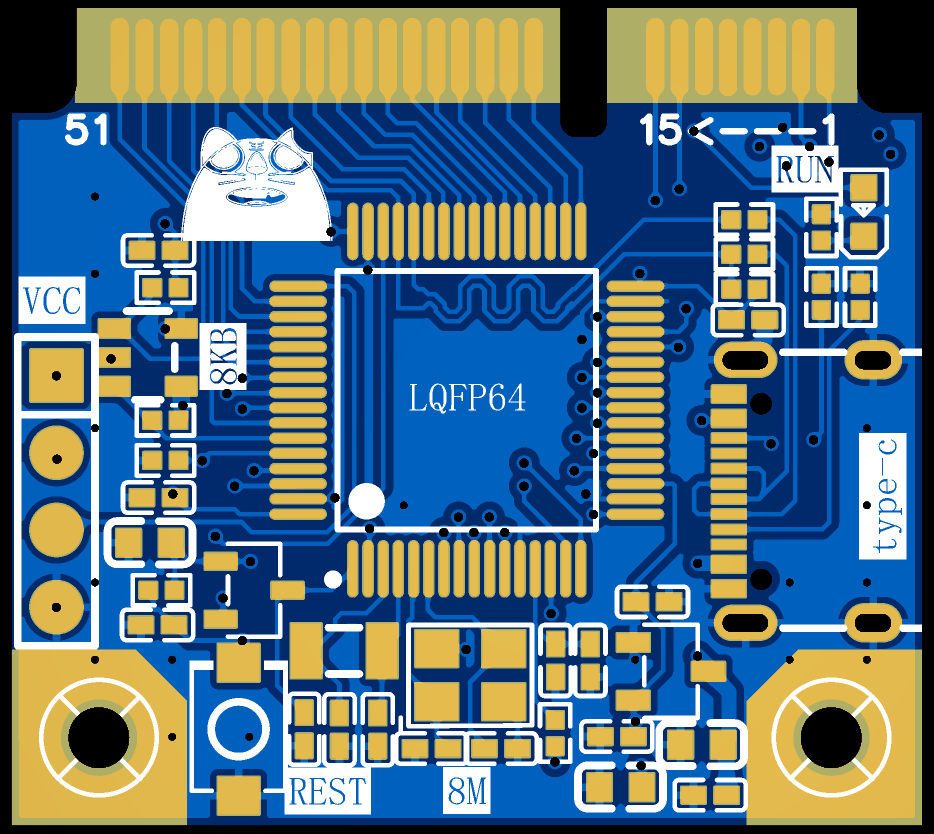
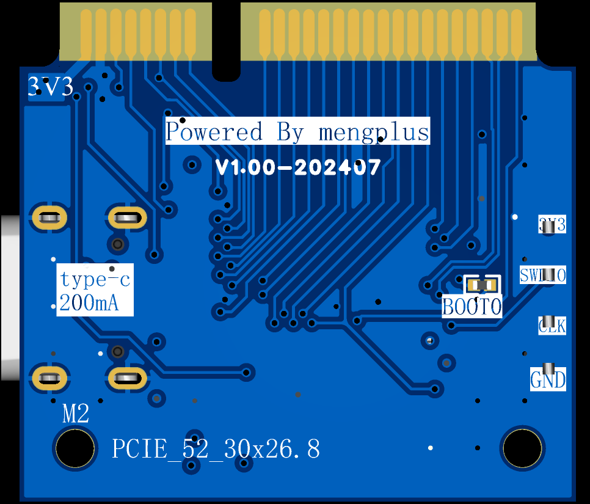
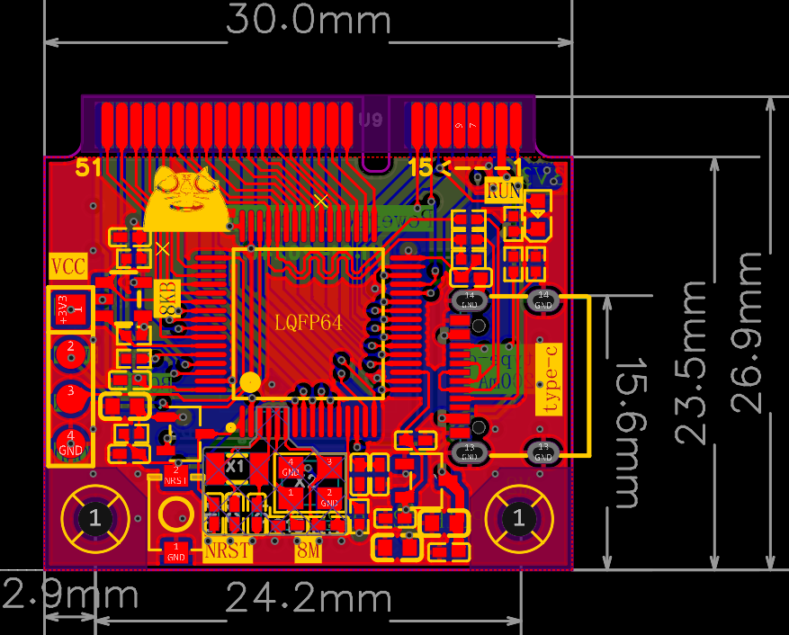

# 核心板介绍
外观与尺寸展示

## 板载资源介绍
1. air32F103RPT6 96Kram 256Kflash 64Pin 216MHz
2. 晶振:8M LSE ,32.768khz LSI
3. XC6206P332MR type-c 接口 3V3最大200mA
4. FT24C08A  EEPROM 8KB 
5. 引出IO :除PB，PB7全引出
6. 输出供电USB的5V
7. 输入3V3，VBAT电池供电
8. 板载一个NRST按键
9. 板载一个LED PB0