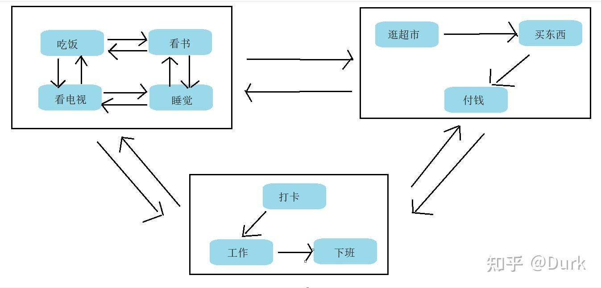

# 层次状态机

结合层次状态机的特点，按照轮询转移的方式，我们分析下状态机进入s11到从s11到s211的转移过程。

 - 最外层状态机进行分发进入s0
 - s0执行运行逻辑，随后进行分发，可以分发到s1，进入s1
 - s1执行运行逻辑，随后进行分发，可以分发到s11，进入s11
 - s11执行运行逻辑，但不是状态机，不能进行分发
 - 随后在某一帧中从s11到s211的转移被满足，从最外层状态机进入时还是分发进入s0
 - s0执行运行逻辑，随后进行分发，因为之前已经分发到s1，也就是当前状态CurState为s1，这 - 是要执行子状态间的转换。从s11到s211的转移被满足，可以从s1转到s2。
 - 在从s1转到s2前，先从s11退出，返回到s1（从s11到s1可以被看做是进入了s1，也即没有进入 - 动作）,再从s1退出，随后进入s2
 - s2执行运行逻辑，随后进行分发，可以分发到s21，进入s21
 - s21执行运行逻辑，随后进行分发，可以分发到s211，进入s211
 - s211执行运行逻辑

有限状态机和分层有限状态机的区别
比如在生活中，我们有吃饭、看书、看电视、睡觉、逛超市、买东西、付钱、打卡、工作、下班等等的状态。我们先试着用普通的状态机去实现，如图：

可以看到仅仅是10个状态，已经让我们眼花缭乱，他们密集的像蜘蛛网一样，难以维护、难以扩展。如果再往上添加状态，还要考虑各个状态与新状态之间是否存在过渡，大大的增加了我们的工作量。

那分层状态机是怎么做的呢？我们可以发现上面的10个状态其实是可以划分出生活场景的。比如吃饭、看书、看电视、睡觉我们一般在家里进行，逛超市、买东西、付钱我们一般在超市进行，打卡、工作、下班我们一般在公司进行。将在一个地方要做的事归到一个生活场景，这样把生活场景也看作一个行为状态，而这个行为状态里面还包括着小的生活状态。就是大状态机驱动小状态机，小状态机驱动状态。就好比校长要管理各个班的班主任，班主任管理整个班级。如图：

这里将10个状态分成的3大类：家、超市、公司。这时只需求控制角色在什么时候进入到这3个大类即可。角色在某个场景里面的具体行为不需要关心。添加新状态时也只需要关心添加在那个大类中，以及与该大类中其他状态之间的转换关系，无需担心其它大类的切换。
