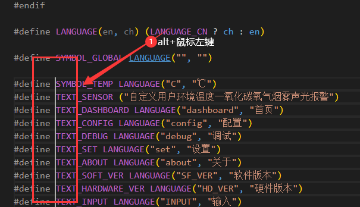
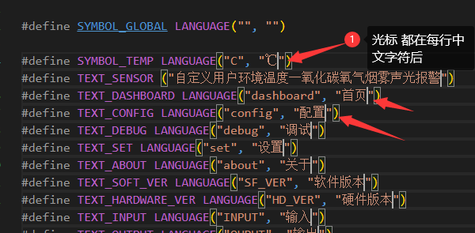
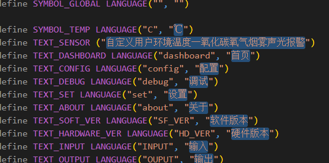
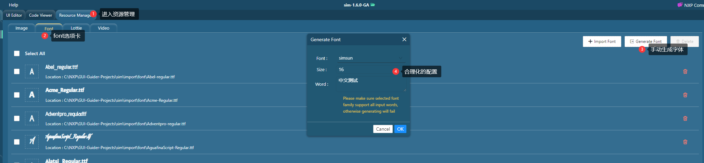
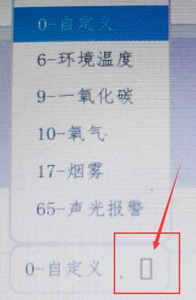
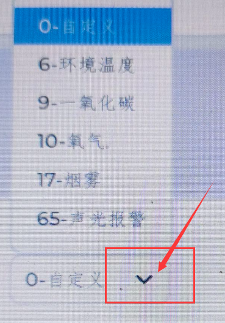

# font字体生成

## 简介

lvgl字库生成需要专用的工具这里推荐使用 `SquareLine Studio`和 `GUI Guider`,可以满足大部分需求，如果只使用英文字符，可能更加省心，不用操心字库是问题，在设计初期建议先使用英文字符，后续再进行汉化操作。

# 汉化方式推荐

为方便先开发后汉化，推荐如下方便规划项目，方便语言切换。

1. 新建 `language.h`头文件放置中文资源
2. 框架规划如下，`LANGUAGE_CN`来控制语言切换

   ```c
   #ifndef __LANGUAGE_H_
   #define __LANGUAGE_H_

   #ifndef LANGUAGE_CN
   #define LANGUAGE_CN 1
   #endif

   #define LANGUAGE(en, ch) (LANGUAGE_CN ? ch : en)

   #define SYMBOL_GLOBAL LANGUAGE("", "")
   #define TEXT_DASHBOARD LANGUAGE("dashboard", "首页")
   #define TEXT_CONFIG LANGUAGE("config", "配置")
   #define TEXT_DEBUG LANGUAGE("debug", "调试")
   #define TEXT_SET LANGUAGE("set", "设置")
   #define TEXT_ABOUT LANGUAGE("about", "关于")
   #define TEXT_SOFT_VER LANGUAGE("SF_VER", "软件版本")
   #define TEXT_HARDWARE_VER LANGUAGE("HD_VER", "硬件版本")
   #endif
   ```
3. 使用方式演示

   ```c
   lv_obj_t *obj;
   obj = lv_tabview_add_tab(tableview, TEXT_ABOUT);
   ```
4. 动态的语言切换

   如果向使用动态的切换效果，可以修改宏 ` #define LANGUAGE(en, ch) (LANGUAGE_CN ? ch : en)` 为函数，方便切换调用如

   ```c
   const char* LANGUAGE(const char*en,const char* ch)
   {
       return (LANGUAGE_CN ? ch : en);
   }
   ```
5. 快捷选中所有中文

   中文字符集中在一个文件虽然方便管理，但是如何便捷的拿到中文字符给软件生成字库仍然是个问题。
   这里推荐使用vscode搭配shift ctrl alt来快捷选中，观察 `language.h`中 TEXT_XXX 结构即可看到明显的规律，

   1. alt按下列选中所有中文字符所在行

      
   2. 松开alt后点击End至行末尾，在操作方向键，左移动两下可得下图位置

      
   3. 重点操作，同时按着ctrl和shift,再操作方向键点击左键即可完成中文的选中操作，具体效果见下图

      
   4. 通过操作3选中后，松手后点击 `ctrl+C`完成所有中文的拷贝。
6. 选择字体
   可以优先考虑win中自带的 `*.tff`字体路径在 `C:\Windows\Fonts`，或者自行网络获取。
7. 官方在线生成字库

   - [在线字体转换器 - TTF 或 WOFF 字体到 C 数组 |LVGL系列](https://lvgl.io/tools/fontconverter)
8. `SquareLine Studio`生成字库操作
   打开 `SquareLine Studio`,随便创建一个工程，找到 `\./assets\fonts`路径，将 `*.tff`字体放入里面，找到界面font列表如下图所示根据需要进行配置后，点击CREATE,完成字库的创建,可以在刚才的路径下找到刚生成的字库加入工程了。
9. `GUI Guider`生成字库操作
   `GUI Guider`生成字库更加简单，他在UI设计过程中能够自动生成字库，因此如果您采用此软件进行界面设计则无需额外生成字库，如果手动生成字库，怎需要新建一个工程，按照下图打开，生成后到工程路径下寻找 `generated\guider_customer_fonts`

   
10. `lv_font_conv-win.exe` 脚本生成

<h2 id="A123"></h2>

```bash
`lv_font_conv-win.exe`是`SquareLine Studio`内置的字库生成程序，但是GUI调取他，并不能完全的发挥他的功效，这里可以考虑自行编写脚本使用它。
1. 编写bat脚本
  参数介绍
   ```bash
   --font:
   ttf/woff/woff2/otf字体路径
   -r, --range
   单个字符或字符范围。可以使用多次
   --size
   输出字符大小-像素
   --format
   输出格式（dump,bin,lvgl）
   --bpp
   每个像素的位数（抗锯齿）
   --no-compress
   禁止压缩（压缩字体能减小大小但会导致渲染速度变慢）
   -o, --output
   输出路径（文件或目录）
   --no-prefilter
   禁用位图行筛选器（XOR），用于提高压缩比。
   ```
   命令示例
   ```bash
    lv_font_conv-win.exe --no-compress --no-prefilter ^
    --bpp 4 --size 16 ^
    --format lvgl -o ui_font_simfang16.c  ^
    --font simfang.ttf --symbols ℃自定义中文部分
    ```
    解释：生成了一个名为`ui_font_simfang16.c`字库，数据不压缩，像素位数4 尺寸16, `simfang.ttf`作为了字体，`--symbols`指定了要生成的中文
```

# 常见问题

1. 使用中文字库后，图标不显示问题（显示为方框）

    
	

解决方式：

1. 主要是选中的中文字库中未包含相应的图标，图标资源在 `FontAwesome5.woff`中,而现有的 `SquareLine Studio`不支持多种图标的直接生成因此需要使用脚本调用 `lv_font_conv-win.exe`生成字库。
   示例：
   1. 安装路径下获取 `\SquareLine Studio 1.3.3\lvgl\lv_font_conv-win.exe`
   2. 与多个资源放到一个文件夹下如

      ```bash
      .
      ├── FontAwesome5-Solid+Brands+Regular.woff
      ├── lv_font_conv-win.exe
      ├── lvgl_create_font.bat
      ├── Montserrat-Medium.ttf
      └── simfang.ttf
      1 directory, 5 files
      ```
   3. 编写bat脚本见[`lv_font_conv-win.exe` 脚本生成](#A123)

      命令示例

      ```bash
       lv_font_conv-win.exe --no-compress --no-prefilter ^
       --bpp 4 --size 16 ^
       --format lvgl -o ui_font_simfang16.c  ^
       --font Montserrat-Medium.ttf -r 0x20-0x7F,0xB0,0x2022 ^
       --font FontAwesome5-Solid+Brands+Regular.woff -r 61441,61448,61451,61452,61452,61453,61457,61459,61461,61465,61468,61473,61478,61479,61480,61502,61507,61512,61515,61516,61517,61521,61522,61523,61524,61543,61544,61550,61552,61553,61556,61559,61560,61561,61563,61587,61589,61636,61637,61639,61641,61664,61671,61674,61683,61724,61732,61787,61931,62016,62017,62018,62019,62020,62087,62099,62212,62189,62810,63426,63650 ^
       --font simfang.ttf --symbols ℃自定义中文部分
      ```
      解释：生成了一个名为 `ui_font_simfang16.c`字库，数据不压缩，像素位数4 尺寸16 用 `Montserrat-Medium.ttf`字体生成ASCII码范围；`FontAwesome5-Solid+Brands+Regular.woff`生成的图标范围见 `lv_symbol_def.h`;`simfang.ttf`生成了中文部分
