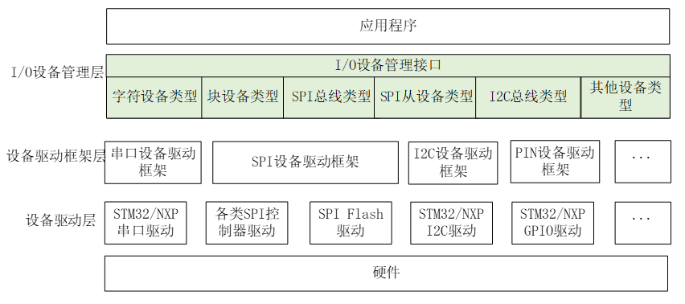
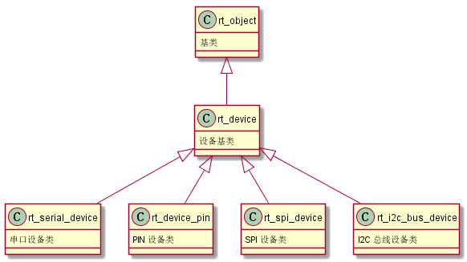

# 设备
## 参考资料
1. https://www.rt-thread.org/document/site/#/rt-thread-version/rt-thread-standard/programming-manual/device/device
## 设备模型


## I/O 设备类型

```c
RT_Device_Class_Char             /* 字符设备       */
RT_Device_Class_Block            /* 块设备         */
RT_Device_Class_NetIf            /* 网络接口设备    */
RT_Device_Class_MTD              /* 内存设备       */
RT_Device_Class_RTC              /* RTC 设备        */
RT_Device_Class_Sound            /* 声音设备        */
RT_Device_Class_Graphic          /* 图形设备        */
RT_Device_Class_I2CBUS           /* I2C 总线设备     */
RT_Device_Class_USBDevice        /* USB device 设备  */
RT_Device_Class_USBHost          /* USB host 设备   */
RT_Device_Class_SPIBUS           /* SPI 总线设备     */
RT_Device_Class_SPIDevice        /* SPI 设备        */
RT_Device_Class_SDIO             /* SDIO 设备       */
RT_Device_Class_Miscellaneous    /* 杂类设备        */

```
其中字符设备、块设备是常用的设备类型，它们的分类依据是设备数据与系统之间的传输处理方式。字符模式设备允许非结构的数据传输，即通常数据传输采用串行的形式，每次一个字节。字符设备通常是一些简单设备，如串口、按键。

块设备每次传输一个数据块，例如每次传输 512 个字节数据。这个数据块是硬件强制性的，数据块可能使用某类数据接口或某些强制性的传输协议，否则就可能发生错误。因此，有时块设备驱动程序对读或写操作必须执行附加的工作，如下图所示：
当系统服务于一个具有大量数据的写操作时，设备驱动程序必须首先将数据划分为多个包，每个包采用设备指定的数据尺寸。而在实际过程中，最后一部分数据尺寸有可能小于正常的设备块尺寸。如上图中每个块使用单独的写请求写入到设备中，头 3 个直接进行写操作。但最后一个数据块尺寸小于设备块尺寸，设备驱动程序必须使用不同于前 3 个块的方式处理最后的数据块。通常情况下，设备驱动程序需要首先执行相对应的设备块的读操作，然后把写入数据覆盖到读出数据上，然后再把这个 “合成” 的数据块作为一整个块写回到设备中。例如上图中的块 4，驱动程序需要先把块 4 所对应的设备块读出来，然后将需要写入的数据覆盖至从设备块读出的数据上，使其合并成一个新的块，最后再写回到块设备中。

## 下图是设备对象的继承和派生关系示意图

从上图可知，所有外设都有一致的基类 **rt_device**,因此了解此基类便能学会大部分的外设的操作方式。

## device基类介绍
源码地址:[struct rt_device](https://github.com/meng-plus/rt-thread/blob/3602f891211904a27dcbd51e5ba72fefce7326b2/include/rtdef.h#L1302-L1338)
```c
struct rt_device
{
    struct rt_object          parent;                   /**< inherit from rt_object */
#ifdef RT_USING_DM
    struct rt_driver *drv;
    void *dtb_node;
#endif
    enum rt_device_class_type type;                     /**< device type */
    rt_uint16_t               flag;                     /**< device flag */
    rt_uint16_t               open_flag;                /**< device open flag */

    rt_uint8_t                ref_count;                /**< reference count */
    rt_uint8_t                device_id;                /**< 0 - 255 */

    /* device call back */
    rt_err_t (*rx_indicate)(rt_device_t dev, rt_size_t size);
    rt_err_t (*tx_complete)(rt_device_t dev, void *buffer);

#ifdef RT_USING_DEVICE_OPS
    const struct rt_device_ops *ops;
#else
    /* common device interface */
    rt_err_t  (*init)   (rt_device_t dev);
    rt_err_t  (*open)   (rt_device_t dev, rt_uint16_t oflag);
    rt_err_t  (*close)  (rt_device_t dev);
    rt_ssize_t (*read)  (rt_device_t dev, rt_off_t pos, void *buffer, rt_size_t size);
    rt_ssize_t (*write) (rt_device_t dev, rt_off_t pos, const void *buffer, rt_size_t size);
    rt_err_t  (*control)(rt_device_t dev, int cmd, void *args);
#endif /* RT_USING_DEVICE_OPS */

#ifdef RT_USING_POSIX_DEVIO
    const struct dfs_file_ops *fops;
    struct rt_wqueue wait_queue;
#endif /* RT_USING_POSIX_DEVIO */

    void                     *user_data;                /**< device private data */
};
```
### 部分参数介绍
| 参数                        | 描述                                         |      |
| --------------------------- | -------------------------------------------- | ---- |
| **ref_count**               | 引用计数，标识设备被多处同时使用的数量       |      |
| **rx_indicate,tx_complete** | 收发回调，串口异步收发常用                   |      |
| **ops**                     | 设备底层操作接口，实际需要根据硬件定义的部分 |      |
